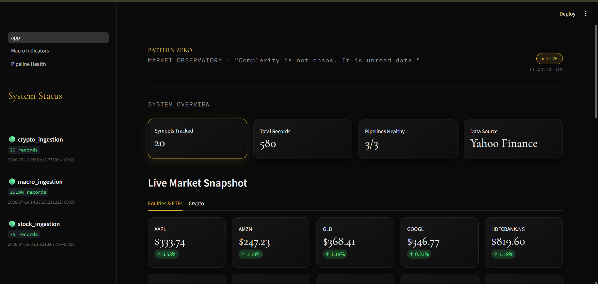
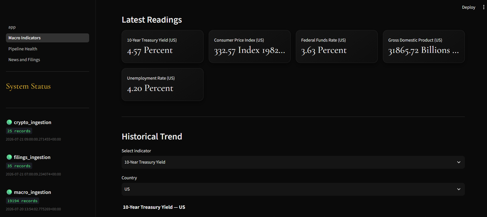
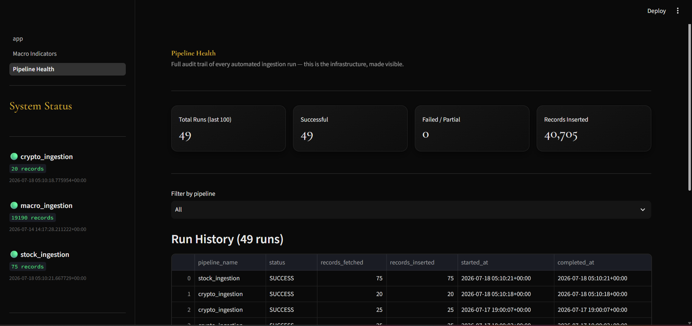
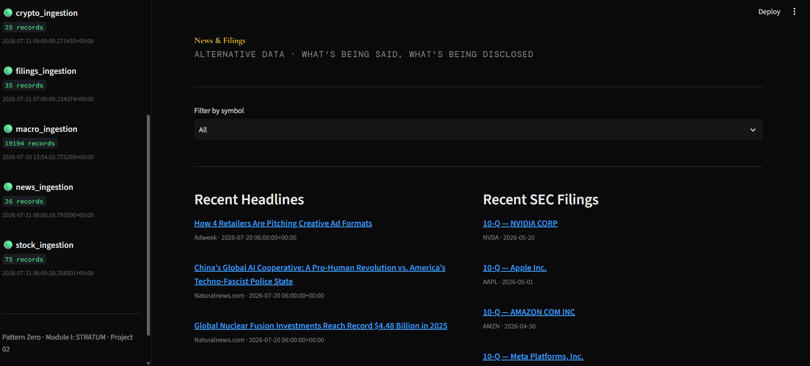

# Pattern Zero — Market Observatory

**Project 02 of Module I: STRATUM** — a live, multi-page dashboard visualizing Pattern Zero's automated financial data pipeline, including alternative data from Project 03.

> *"Complexity is not chaos. It is unread data."*


🔗 **[Live Demo](https://pattern-zero-observatory-007.streamlit.app)**

---

## What it does

The Observatory is the visual face of STRATUM — it reads live from the same Neon-hosted Postgres database that STRATUM's Airflow pipelines fill automatically, with zero duplicate data logic. Four pages:

- **🗺️ Home** — executive overview (symbols tracked, price/macro/news/filings record counts, pipeline health at a glance), a top filter bar, live market snapshot for equities/ETFs/crypto with real-time % change, and interactive candlestick history charts
- **🏛️ Macro Indicators** — latest macroeconomic readings (GDP, CPI, Fed funds rate, Treasury yields) with historical trend charts
- **🛰️ Pipeline Health** — full audit trail of every ingestion run across all five pipelines, filterable, with expandable error details for any failures
- **🗞️ News & Filings** — recent headlines and SEC filing metadata side by side, filterable by symbol (Project 03 surface)

## Screenshots

### Home — Live Market Snapshot


### Macro Indicators


### Pipeline Health


### News and Filings



## Tech stack

- **Streamlit** — multi-page app framework
- **Plotly** — interactive candlestick and line charts, unified styling via a shared layout helper (`get_chart_layout()`)
- **SQLAlchemy** — read-only connection into STRATUM's Postgres database
- **Neon** — serverless Postgres hosting (production database, shared with STRATUM's ingestion layer)
- Custom dark theme (Obsidian/Fossil Gold/Ghost Silver) matching Pattern Zero's brand identity, centralized in `utils/theme.py` and applied consistently across every page

## Architecture

STRATUM's Neon Postgres (read-only)
│
▼
SQLAlchemy queries
(utils/db.py — shared connection)
│
▼
Streamlit multi-page app
app.py · pages/Macro_Indicators · pages/Pipeline_Health · pages/News_and_Filings
│
▼
Plotly visualizations + live pipeline status sidebar
(utils/sidebar.py — rendered on every page)


The Observatory never writes to the database — strictly read-only, keeping it fully decoupled from ingestion.

## Running it locally

The live demo above reads from a Neon-hosted database (production), continuously updated by STRATUM's Airflow pipelines. To run your own copy of the Observatory, point it at either that same Neon database or your own local STRATUM instance:

```bash
git clone https://github.com/Auraangel07/pattern-zero-observatory.git
cd pattern-zero-observatory
cp .env.example .env
pip install -r requirements.txt
python -m streamlit run app.py
```

Set these in `.env` — either Neon credentials (matching STRATUM's production database) or your own local TimescaleDB container's credentials:

```env
DB_HOST=your-neon-host.neon.tech   # or "timescaledb" for a local Docker setup
DB_PORT=5432
DB_NAME=neondb                      # or "pattern_zero" for local
DB_USER=your_neon_user
DB_PASSWORD=your_neon_password
```

The Observatory is strictly read-only — it queries whichever database STRATUM's ingestion is writing to. It has no opinion on where that database lives; Neon and local Docker Postgres both work identically from its perspective.

> **Note:** on Windows machines with Application Control policies enabled, `streamlit run app.py` may be blocked as an unsigned executable. Use `python -m streamlit run app.py` instead.

## Project Status

Project 02 of Module I. Complete — four pages, live data, consistent theming, no known bugs.

## Roadmap

Module I (STRATUM) is sealed — all three projects (Financial Data Lake + API, Market Observatory, Alternative Data Pipeline) complete. Next: **Module II — THE CALCULUS.**

---

*Built as part of Pattern Zero — an independent financial AI research project.*